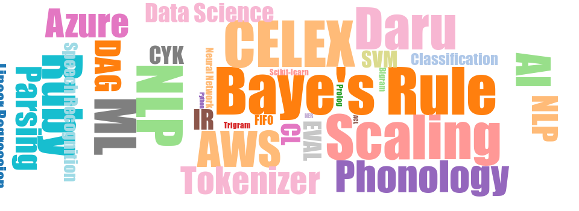

[[RubyNLP](https://github.com/arbox/nlp-with-ruby) |
 [RubyML](https://github.com/arbox/machine-learning-with-ruby) |
 [RubyInterop](https://github.com/arbox/ruby-interoperability)]

# Awesome Data Science with Ruby 

> Links and Resources for Data Processing and Analysis in Ruby

[Data Science](https://en.wikipedia.org/wiki/Data_science) is a new
"sexy" buzzword without specific meaning but often used to substitute
Statistics, Scientific Computing, Text and Data Mining and
Visualization, Machine Learning, Data Processing and Warehousing as
well as Retrieval Algorithms of any kind.

This curated list comprises [_awesome_][awesome] tutorials, libraries,
information sources about various Data Science applications using
the [Ruby programming language][ruby].

A lot of useful resources on this list come from the development by
[The Ruby Science Foundation][sciruby], our [contributors][contributors] and
our own day to day work on various data intensive applications.
Read [why](#wait-but-why) this list is awesome.

:sparkles: Every [contribution](contributing.md) is welcome!
Add links through pull requests or create an issue to start a discussion.

Follow us on [Twitter](https://twitter.com/NonWebRuby)
and please spread the word using the `#RubyDataScience` hash tag!

<!-- nodoc -->

## Contents

<!-- toc -->

- [Ruby vs. Python vs. Julia vs. R](#ruby-vs-python-vs-julia-vs-r)
- [Standing on the shoulders of giants](#standing-on-the-shoulders-of-giants)
- [Data Manipulation](#data-manipulation)
- [Distributed Computing](#distributed-computing)
- [Data Structures](#data-structures)
- [Data sets](#data-sets)
- [Statistics](#statistics)
- [Numeric and Symbolic Computation](#numeric-and-symbolic-computation)
- [Visualization](#visualization)
- [Interactive Computing](#interactive-computing)
- [Input and Output](#input-and-output)
  * [General formats](#general-formats)
  * [Database Adapters](#database-adapters)
  * [Domain specific formats](#domain-specific-formats)
- [Provisioning Infrastructure](#provisioning-infrastructure)
- [Machine Learning](#machine-learning)
- [Articles, Posts, Talks, and Presentations](#articles-posts-talks-and-presentations)
- [Related resources](#related-resources)
- [Wait but why?](#wait-but-why)
- [License](#license)

<!-- tocstop -->

<!-- doc -->

## Ruby vs. Python vs. Julia vs. R

| Ruby   | Python | Julia | R   |
| ---    | ---    | ---   | --- |
| Daru   | Pandas |       |     |
| NArray | NumPy  |       |     |

## Standing on the shoulders of giants

Ruby is (for now) not a Data Science centric language with a very large established library.
Leveraging libraries from R, Python, and Julia helps Ruby to solve your tasks!
<!--- TODO: Add the talk by @mrkn --->

- [pycall](https://github.com/mrkn/pycall.rb) &mdash; Bridge into the Python world.
- [rserve-client](https://github.com/clbustos/Rserve-Ruby-client) &mdash;
  Ruby connector for [Rserve](http://www.rforge.net/Rserve/), R's binary server.

## Data Manipulation

- [kiba](https://github.com/thbar/kiba/) &mdash;
  lightweight Ruby ETL (Extract-Transform-Load) framework.
- [jongleur](https://gitlab.com/RedFred7/Jongleur) &mdash;
  Workflow manager using DAG definitions to execute ETL tasks.

## Distributed Computing

- [ruby-spark](https://github.com/ondra-m/ruby-spark) &mdash;
  Ruby Interface to [Apache Spark](https://spark.apache.org/) 1.x.x.
- [jruby-spark](https://github.com/chyh1990/jruby-spark) &mdash;
  JRuby based bindings for [Apache Spark](https://spark.apache.org/).

## Data Structures

- [daru](https://github.com/SciRuby/daru) &mdash;
  Data Frame and Vector structures with comprehensive manipulating and visualization methods.
- [numo-narray](https://github.com/ruby-numo/numo-narray) &mdash;
  n-dimensional Numerical Array for Ruby.
- [nmatrix](https://github.com/sciruby/nmatrix) &mdash;
  dense and sparse linear algebra library for Ruby via [SciRuby](http://sciruby.com/).
- [kdtree](https://github.com/gurgeous/kdtree) &mdash;
  blazingly fast native 2d k-d tree.
- [mdarray](https://github.com/rbotafogo/mdarray) &mdash;
  Array structure for `JRuby`.
- [spreadsheet](https://github.com/zdavatz/spreadsheet) &mdash;
  manipulation library for MS Excel spreadsheets.
- [networkx](https://github.com/SciRuby/networkx.rb) &mdash;
  Ruby based [NetworkX](https://networkx.github.io/) clone that handles various
  usecases of the Graph Data Structure.
- [cumo](https://github.com/sonots/cumo) &mdash;
  CUDA-aware numerical Array library with [NArray](https://github.com/ruby-numo/numo-narray) similar interface.

## Data sets

- [rdatasets](https://github.com/kojix2/rdatasets) &mdash;
  Data sets available in R via [Rdatasets](https://github.com/vincentarelbundock/Rdatasets).
- [red-datasets](https://github.com/red-data-tools/red-datasets) &mdash;
  Growing collection of publicly available data sets such as CIFAR-10, Iris, MNIST etc.

## Statistics

- [rb-gsl](https://github.com/blackwinter/rb-gsl) &mdash;
  Ruby interface to the GNU Scientific Library. [[dep: GLS](#gls)]
- [simple_stats](https://github.com/brianhempel/simple_stats) &mdash;
  `Enumerable` patches for descriptive statistics.
- [enumerable-statistics](https://github.com/mrkn/enumerable-statistics) &mdash;
  fast implementation of descriptive statistics for the `Enumerable` module.
- [statsample](https://github.com/sciruby/statsample) &mdash;
  basic and advanced statistics for Ruby. [[dep: GLS](#gls)]
- [statsample-glm](https://github.com/sciruby/statsample-glm) &mdash;
  extension of `statsample` by Generalized Linear Models.
- [statsample-bivariate-extension](https://github.com/sciruby/statsample-bivariate-extension) &mdash;
  extension of `statsample` by Bivariate Correlations.
- [statsample-timeseries](https://github.com/sciruby/statsample-timeseries) &mdash;
  extension of `statsample` by Time Series estimators.
- [pca](https://github.com/gbuesing/pca) &mdash;
  Principal Component Analysis (PCA) in Ruby.
- [descriptive-statistics](https://github.com/jtescher/descriptive-statistics) &mdash;
  descriptive extensions for the `Enumerable` module or standalone usage.
- [distribution](https://github.com/sciruby/distribution) &mdash;
  probabilistic distributions and descriptive measures for them.
- [statistics2](https://github.com/abscondment/statistics2) &mdash;
  Normal, Chi-square, t- and F- probability distributions for Ruby.

## Numeric and Symbolic Computation

- [numo-linalg](https://github.com/ruby-numo/numo-linalg) &mdash;
  linear algebraic operations for NArray.
- [numo-gsl](https://github.com/ruby-numo/numo-gsl) &mdash;
  Math and Statistics for NArray using GSL.[[dep: GSL](#gsl)]
- [symengine](https://github.com/symengine/symengine.rb) &mdash;
  Symbolic Computation with [SymEngine](https://github.com/symengine/symengine).
- [numo-ffte](https://github.com/ruby-numo/numo-ffte) &mdash;
  Fast Fourier Transformation for NArray using the FFTE package.[[FFTE](#ffte)]

## Visualization

Comprehensive tools for Data Visualization.

- [matplotlib](https://github.com/mrkn/matplotlib.rb) &mdash;
  Ruby based wrapper around [matplotlib](https://matplotlib.org/).
  [[dep: matplotlib](#matplotlib)]
- [mathematical](https://github.com/gjtorikian/mathematical) &mdash;
  PNG and MathML renderings for your equations.
- [daru-view](https://github.com/sciruby/daru-view) &mdash;
  daru-view is interactive plotting gem for web application
  (any Ruby web application framework like Rails/Sinatra/Nanoc/Hanami) & IRuby notebook. 
  It is a plugin gem for daru.
- [daru-plotly](https://github.com/genya0407/daru-plotly) &mdash;
  [Plotly](https://plot.ly/) based visualization for Daru.
- https://github.com/v0dro/benchmark-plot
- https://github.com/domitry/Nyaplotjs
- https://github.com/domitry/nyaplot
- https://github.com/SciRuby/gnuplotrb
- [ruby-graphviz](https://github.com/glejeune/Ruby-Graphviz)
  [[dep: Graphviz](#graphviz)]
- [gnuplot](https://github.com/rdp/ruby_gnuplot/tree/master)
  [[dep: gnuplot](#gnuplot)]
- https://github.com/zuhao/plotrb
- https://github.com/brasten/scruffy
- https://github.com/zverok/worldize
- https://github.com/masa16/ruby-mathgl
- [numo-gnuplot](https://github.com/ruby-numo/numo-gnuplot) &mdash;
  gnuplot interface for the Numo package.

## Interactive Computing

- [iruby](https://github.com/sciruby/iruby) &mdash;
  Ruby kernel for [Jupyter](https://jupyter.org/).
- [iruby-rails](https://github.com/mrkn/iruby-rails) &mdash;
  Integration library for IRuby and Rails.

## Input and Output

### General formats

- https://github.com/fiksu/rcsv
- [ox](https://github.com/ohler55/ox) &mdash;
  Optimized for speed XML parser and object marshaller.
- [oj](https://github.com/ohler55/oj) &mdash;
  High-speed JSON parser.
- Markdown
- Nokogiri
- CSV

### Database Adapters

- pg
- Mongo
- MySQL

### Domain specific formats

- BibTeX
- [inih](https://github.com/woodruffw/ruby-inih) &mdash; fast C based INI parser for Ruby.
- [bolognese](https://github.com/datacite/bolognese) &mdash;
  conversion tool for citation formats like BibTeX, RIS, or Crossref XML.

## Provisioning Infrastructure

- https://github.com/mrkn/gpu-instance
- https://github.com/mrkn/computing_node
- https://github.com/k1LoW/awspec

## Machine Learning

Please look at our extensive [Awesome ML with Ruby][ml-with-ruby] list.

## Articles, Posts, Talks, and Presentations

- 2019
  - _Parallelising ETL workflows with the Jongleur gem_ by [Fred Heath](https://github.com/RedFred7)
  [[post](http://bootstrap.me.uk/gems/2019/01/06/jongleur-etl.html)]
- 2018
- 2017
  - _Progress of Ruby-Numo: Numerical Computing for Ruby_ by [Masahiro Tanaka](https://github.com/masa16)
    [[slides](https://speakerdeck.com/masa16tanaka/progress-of-ruby-numo-numerical-computing-for-ruby)]
  - _Chartkick: data visualization made easy with Ruby_ by [Govind Unnikrishnan](https://twitter.com/govind_k_u)
    [[post](https://blog.redpanthers.co/chartkick-data-visualization-easy-ruby/)]
  - _Development of Data Science Ecosystem for Ruby_ by [Kenta Murata](https://twitter.com/mrkn)
    [[slides](https://speakerdeck.com/mrkn/development-of-data-science-ecosystem-for-ruby) |
          [video](https://www.youtube.com/watch?v=U9GdgZowmGY) |
          [page](https://rubykaigi.org/2017/presentations/mrkn.html)]
- 2016
  - _Scientific Computation and Data Visualization with Ruby_ by [Sameer Deshmukh](https://twitter.com/v0dro)
    [[slides](https://www.slideshare.net/SrijanOne/webinar-scientific-computation-and-data-visualization-with-ruby) |
          [video](https://www.youtube.com/watch?v=5970kC6MfBE)]
- 2015
- 2014
- 2013
  - _Seeing the Big Picture: Quick and Dirty Data Visualization with Ruby_ by [Aja Hammerly](https://twitter.com/the_thagomizer)
    [[video](https://www.youtube.com/watch?v=dWPRLCU39AU) |
          [slides](http://www.thagomizer.com/files/dataviz_windy_city_13.pdf) |
          [code](https://github.com/thagomizer/data_visualization_talk)]
- 2012
- 2011
- 2010
  - _NArray and scientific computing with Ruby_ by [Masahiro Tanaka](https://twitter.com/masa16tanaka)
    [[video](https://vimeo.com/14823720) |
          [slides](https://www.slideshare.net/masa16tanaka/narray-and-scientific-computing-with-ruby)]

## Community

- https://gitter.im/red-data-tools/en
- https://gitter.im/red-data-tools/ja
- http://ruby-data.org/
- https://twitter.com/RubyData
- https://discourse.ruby-data.org/

## Related resources

- [Awesome Data Science with Python](https://github.com/r0f1/datascience)
- 
  [ImageMagick](https://imagemagick.org/index.php)
- 
  [GSL](https://www.gnu.org/software/gsl/)
- 
  [FFTE](http://www.ffte.jp/)
- 
  [SymEngine](https://github.com/symengine/symengine)
- [Awesome Big Data](https://github.com/onurakpolat/awesome-bigdata#data-visualization) -
  awesome curated list on all around Big Data.
- [Awesome Spark](https://github.com/awesome-spark/awesome-spark) &mdash;
  awesome list on Apache Spark goodies.

## Wait but why?

There are a lot of software lists with tools related to the Data Science.
There are a couple of lists with Ruby related projects. There are no lists of
only working and tested software with documented scope. We'll try to make one!

What is awesome? Awesome are documented, maintained and focused tools.

Can something turn not awesome at a point? Yes! Abandoned projects with broken
dependencies aren't awesome any more! They leave this list.

## License

 `Awesome Data Science with Ruby` by [Andrei Beliankou](https://github.com/arbox) and
[Contributors][contributors].

To the extent possible under law, the person who associated CC0 with
`Awesome Data Science with Ruby` has waived all copyright and related or neighboring rights
to `Awesome Data Science with Ruby`.

You should have received a copy of the CC0 legalcode along with this
work. If not, see <https://creativecommons.org/publicdomain/zero/1.0/>.

<!--- Links --->
[ruby]: https://www.ruby-lang.org/en/
[ml-with-ruby]: https://github.com/arbox/machine-learning-with-ruby
[awesome]: https://github.com/sindresorhus/awesome/blob/master/awesome.md
[change-pr]: https://github.com/RichardLitt/knowledge/blob/master/github/amending-a-commit-guide.md
[sciruby]: https://github.com/sciruby
[contributors]: https://github.com/arbox/data-science-with-ruby/graphs/contributors
